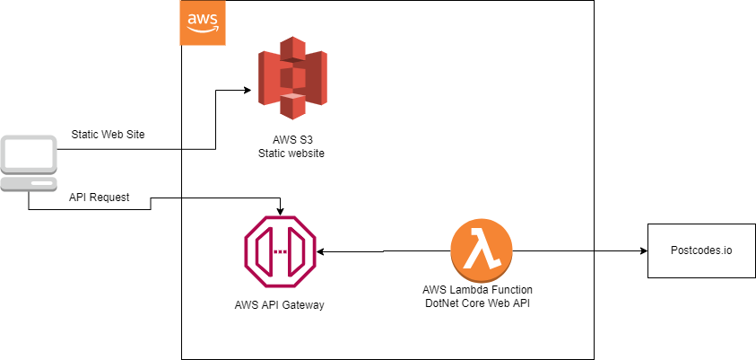

# Introduction

This is React JS single page application that consumes the PostCodes Web API and presenting a autocomplet functionality to search post codes. The user should able to select a result from the autocomplete which gives the details for selected post code. Post code detail is a below: 
1.  Country
2.	Region
3.	Admin District
4.	Parliamentary Constituency
5.	Area

## Components Used in Postal Code Search App

Bootstrap\
React-Select Async\
use-debounce\
axios

What is React-Select Async?\
Use the Async component to load options from a remote source as the user types.\

What is use Debounce?\
The debounce() function forces a function to wait a certain amount of time before running again. The function is built to limit the number of times a function is called. The Send Request() function is debounced. Requests are sent only after fixed time intervals regardless of how many times the user presses the button.\

[https://www.npmjs.com/package/use-debounce](https://www.npmjs.com/package/use-debounce)

What is Axios?\
Axios is a promise-based HTTP Client for node.js and the browser.


## Command to run Postal Code Search App
```
npm install
npm start
open http://localhost:3000
```

## Usefull Comands

In the project directory, you can run:

### `npm start`

Runs the app in the development mode.\
Open [http://localhost:3000] (http://localhost:3000) to view it in the browser.

The page will reload if you make edits.\
You will also see any lint errors in the console.

### `npm run build`

Builds the app for production to the `build` folder.\
It correctly bundles React in production mode and optimizes the build for the best performance.

The build is minified and the filenames include the hashes.\
Your app is ready to be deployed!


## Basic Request Flow Diagram

